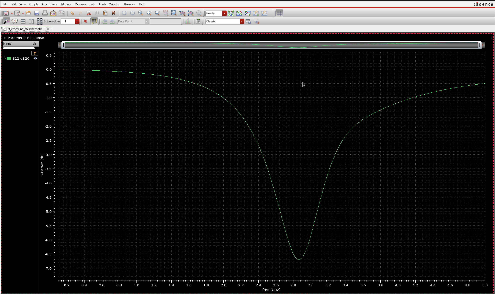
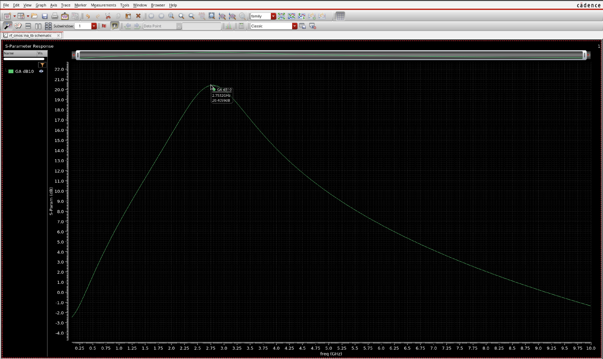
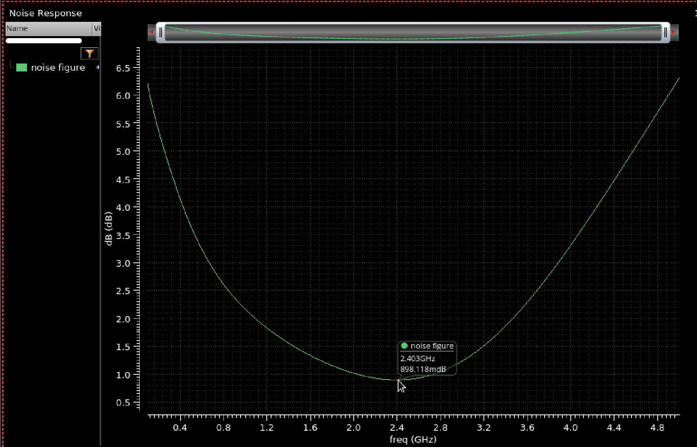

# 2.4 GHz RF CMOS Low Noise Amplifier (LNA) Design – 45 nm Technology

## Overview
This repository contains the design, simulation, and layout of a **2.4 GHz RF Low Noise Amplifier (LNA)** implemented using **45 nm CMOS technology** in **Cadence Virtuoso**. The project focuses on achieving low noise, high gain, and stable operation for RF receiver front-end applications operating in the **2.4 GHz ISM band**.

The LNA uses a **common-source topology with inductive source degeneration and cascode configuration** to improve gain, stability, and isolation. A **gm/ID-based design methodology** was used for transistor sizing and bias optimization to achieve low noise performance.

---

## Design Specifications

| Parameter | Value |
|----------|------|
| Technology | 45 nm CMOS |
| Supply Voltage (VDD) | 1 V |
| Operating Frequency | 2.4 GHz |
| Topology | Inductive Source Degenerated Common Source with Cascode |
| Design Tool | Cadence Virtuoso |

---

## Key Performance Results

| Parameter | Result |
|----------|-------|
| Available Gain (GA) | 20.39 dB |
| Noise Figure (NF) | 0.89 dB |
| Input Reflection Coefficient (S11) | ≈ −7 dB |
| Stability Factor (Kf) | > 1 at 2.4 GHz |

---

## Design Methodology

The amplifier was designed using a **gm/ID methodology** to determine the optimal biasing region for minimum noise and sufficient transconductance.

Design steps:

1. Selection of **inductive source degeneration LNA topology**
2. Implementation of a **cascode stage** for improved gain and isolation
3. Biasing the NMOS transistor in **moderate inversion**
4. Optimization of **input matching network**
5. Verification of **stability using Rollett Stability Factor (Kf)**
6. Layout implementation following **RF layout practices**

---

---

## Schematic

Add the schematic screenshot below.

---

## Testbench

Add the testbench screenshot below.

---

## Simulation Results

### Input Reflection Coefficient (S11)

### Available Gain (GA)

### Noise Figure

### Stability Factor (Kf)

---

## Layout Implementation

The layout was implemented in Cadence Virtuoso following RF layout practices:

- Multi-finger NMOS transistor implementation
- Guard rings for substrate isolation
- Short RF routing paths
- Wide metal routing for power and RF nodes
- Layout prepared for DRC and LVS verification

---

## Tools Used

- Cadence Virtuoso
- Spectre RF Simulator
- 45 nm CMOS PDK

---

## Applications

This LNA design is applicable for:

- 2.4 GHz ISM band receivers
- Wireless communication front-end circuits
- IoT RF transceivers
- Low power RF receiver architectures

---

## Future Work

Potential improvements include:

- Post-layout parasitic extraction (PEX) analysis
- Improved input matching (target S11 ≤ −10 dB)
- Linearity analysis (IIP3, P1dB)
- Integration with full RF receiver chain

---

## Author

- Pulkit Yadav 
- Electronics and Communication Engineering
- IIIT Dharwad
- Analog RF IC Design

